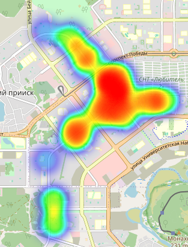
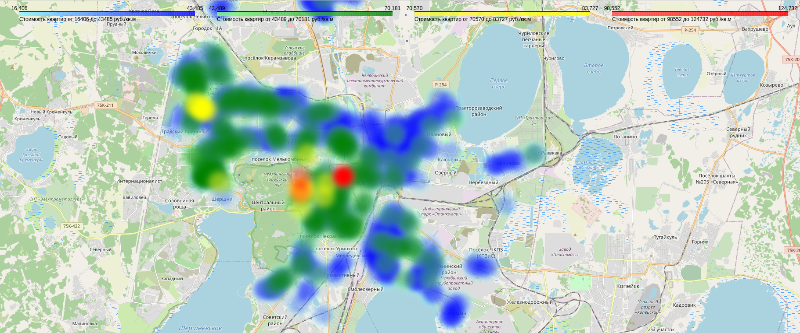
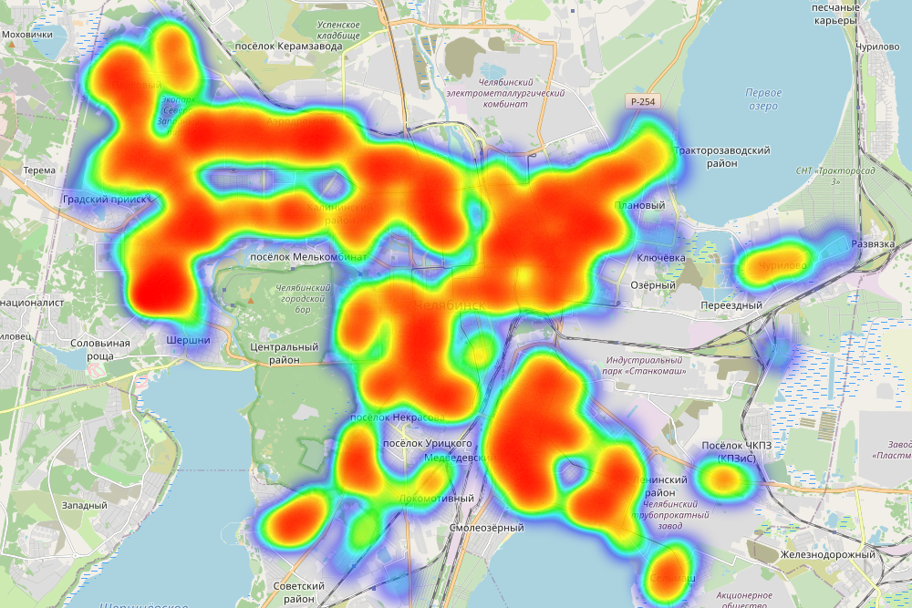
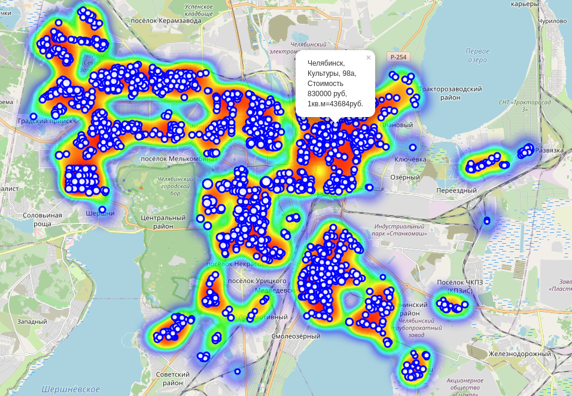
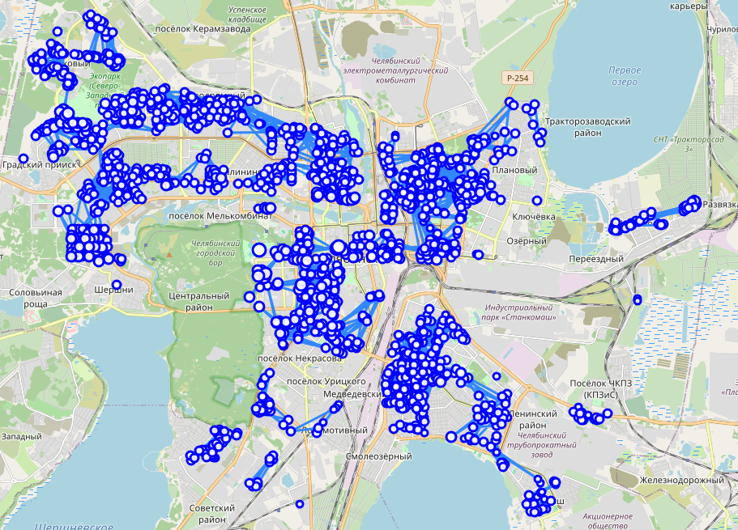

<h3>О скрипте</h3>

Скрипт на python для построения тепловых карт.

<h3>Зависимости</h3>

Используются библиотеки:

<ul>
  <li>pandas</li>
  <li>PIL</li>
  <li>folium</li>
  <li>turfpy</li>
  <li>geojson</li>
</ul>

<h3>Описание</h3>

Скрипт на python для построения тепловых карт цен на жильё.

В папке A находится скрипты для построения тепловых карт концентрации и тепловые точки

<i>Тепловые точки</i>

<i>Тепловая карта концентрации</i>

<i>Тепловые точки концентрации</i>

 

В папке B находятся скрипты для построения тепловых карт с маркерами

<i>Тепловые точки с диапазоном</i>

<i>Тепловая карта концентрации</i>

<i>Тепловая карта концентрации с маркерами</i>

<i>Маркеры и расстояние между ними</i>

 

В папке C находятся примеры работы со скриптом.

 

В папке D основной скрипт и <a href="./D/инстр.docx">инструкция</a> к нему. При построении тепловой карты используется аппроксимация по методу обратно взвешенных расстояний.

